<div align="center">



<br/><br/>

<a href="https://chromewebstore.google.com/detail/funpay-tools/pibmnjjfpojnakckilflcboodkndkibb/"></a>
&nbsp;
<a href="#-для-разработчиков"></a>

<br/><br/>


<br/><br/>


<br/><br/>


<br/><br/>




<br/><br/>




</div>

<details>
<summary>&nbsp;<b>🤖 Всё, что умеет автоответчик</b></summary>
<br/>

| | |
| :--- | :--- |
| **Фоновая работа** | Отдельный движок с защитой от сна — работает даже при свёрнутом браузере |
| **Авто-приветствие** | Новым покупателям, с кулдауном и фильтром системных сообщений |
| **Триггеры** | Оплата заказа и подтверждение получения |
| **Отзывы** | Свой шаблон на каждую оценку от 1 до 5★ и бонус за 5★ |
| **Команды** | `!реквизиты` и любые свои триггеры |
| **Переменные** | `{buyername}` `{lotname}` `{orderid}` `{orderlink}` `{ai:пожелай хорошего дня}` |
| **Картинки** | В шаблонах, с выбором порядка: текст или фото первым |
| **Естественность** | Имитация набора текста перед отправкой |
| **Анти-спам** | Не отвечает сам себе, не флудит, игнорирует рассылки FunPay |

</details>

<div align="center">

<br/>




</div>

<details>
<summary>&nbsp;<b>💬 И ещё в чате</b></summary>
<br/>

Черновики не теряются между чатами · история покупок собеседника · экспорт переписки в `.txt` · ответы на конкретные сообщения · заметки с автосохранением · «Прочитать всё» одним кликом · цветные метки покупателей · метка «Свой-Чужой» для пользователей Funcy

</details>

<div align="center">

<br/>




<br/><br/>




<br/><br/>


<a href="https://chromewebstore.google.com/detail/funpay-tools/pibmnjjfpojnakckilflcboodkndkibb/"></a>

<br/><br/>

<a id="-для-разработчиков"></a>


</div>

```bash
git clone https://github.com/jgchkcu-maker/funpay-funcy.git
```

Откройте `chrome://extensions` → включите **режим разработчика** → **«Загрузить распакованное»** → выберите папку проекта. Правите файл — нажимаете ↻ у расширения — готово.

```text
funpay-funcy/
├── background/   service worker: автоответчик, автоподнятие, автовыдача, планировщик
├── content/      всё, что работает на страницах FunPay: фичи, меню, темы
├── popup/        окно расширения
├── offscreen/    парсинг HTML в фоне
├── css/          стили и темы
├── tests/        автотесты на node:test
└── manifest.json
```

```bash
node --test tests/*.test.js
```

<div align="center">

<br/>

<a href="https://github.com/jgchkcu-maker/funpay-funcy/issues/new/choose"></a>

<br/><br/>

<a href="https://star-history.com/#jgchkcu-maker/funpay-funcy&Date">
  <picture>
    <source media="(prefers-color-scheme: dark)" srcset="https://api.star-history.com/svg?repos=jgchkcu-maker/funpay-funcy&type=Date&theme=dark"/>
    
  </picture>
</a>

<sub>Помогло заработать — поставьте ⭐ · Лицензия <a href="LICENSE">MIT</a></sub>


</div>
