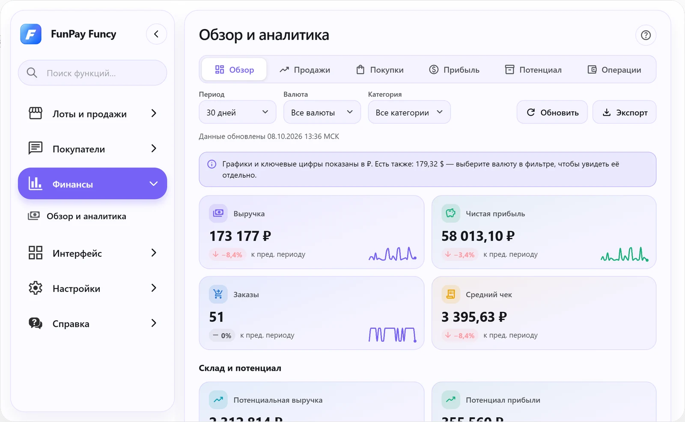
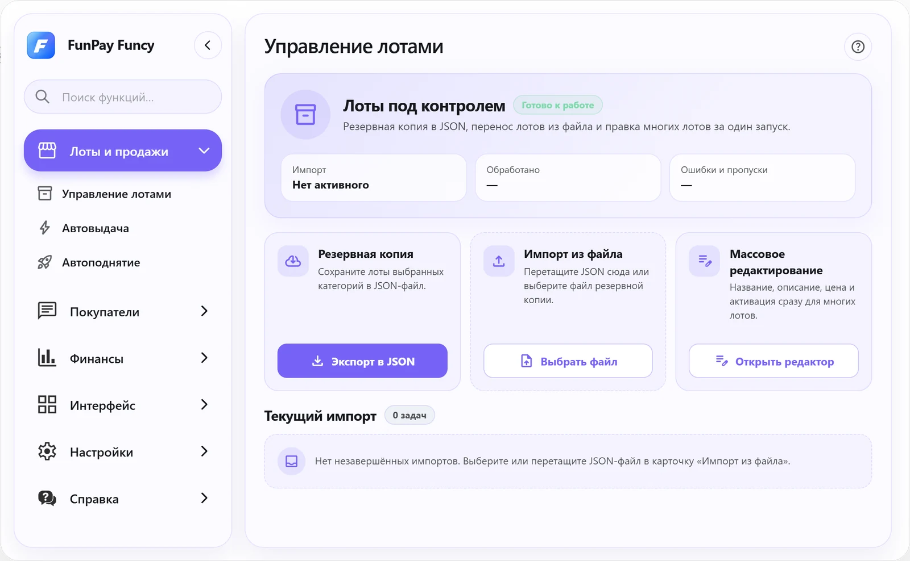
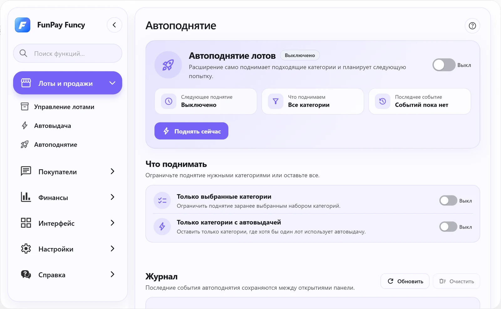
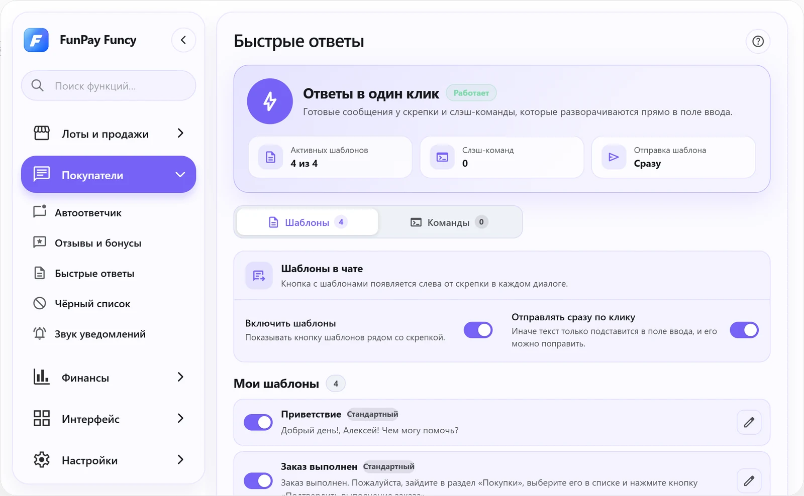
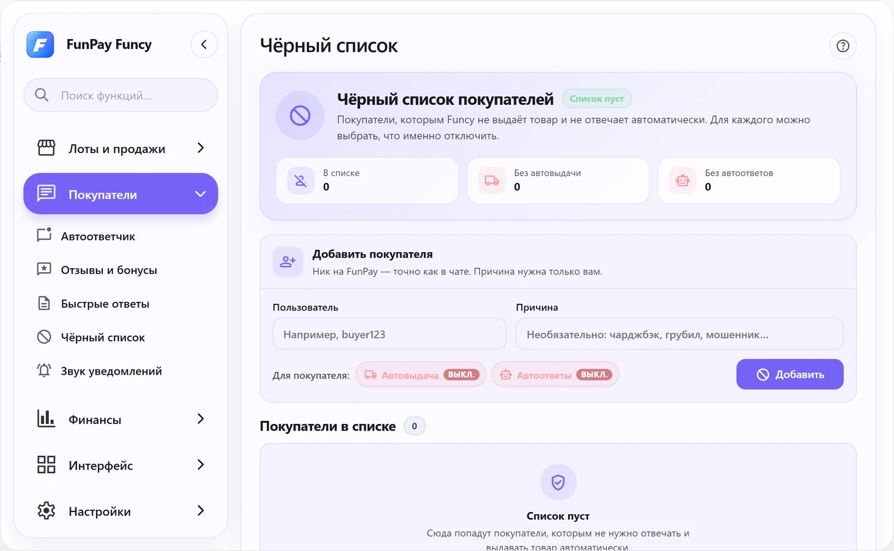
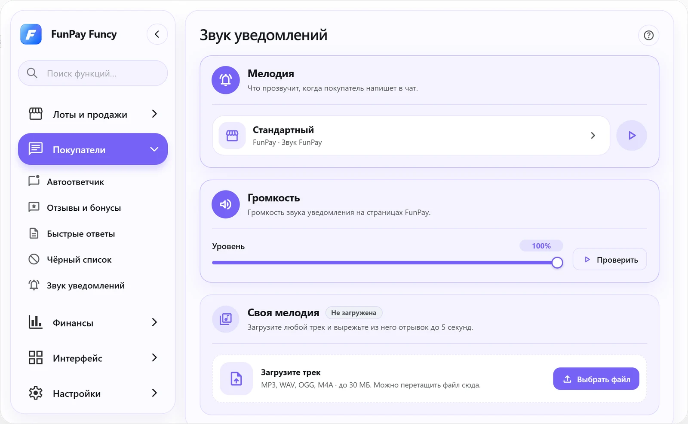
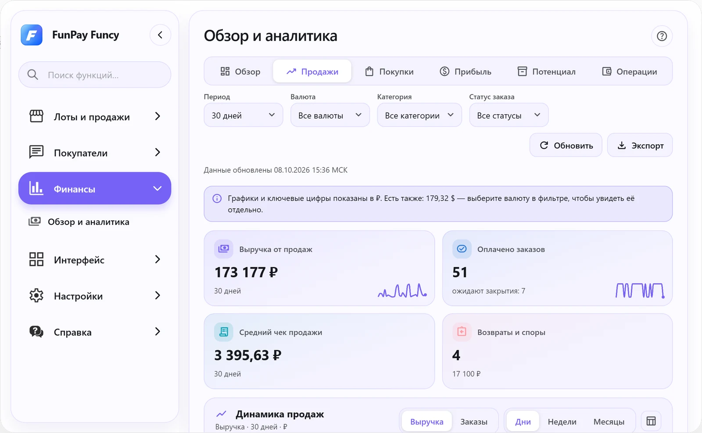
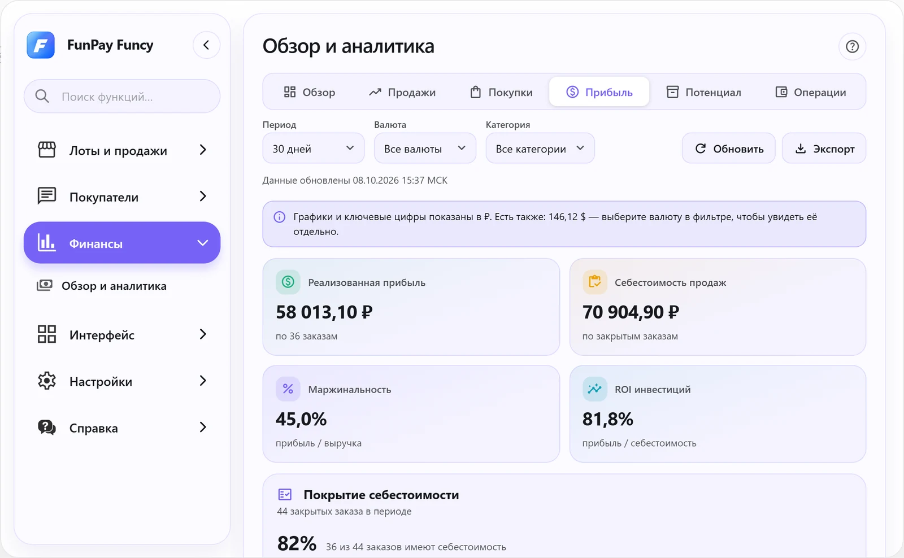
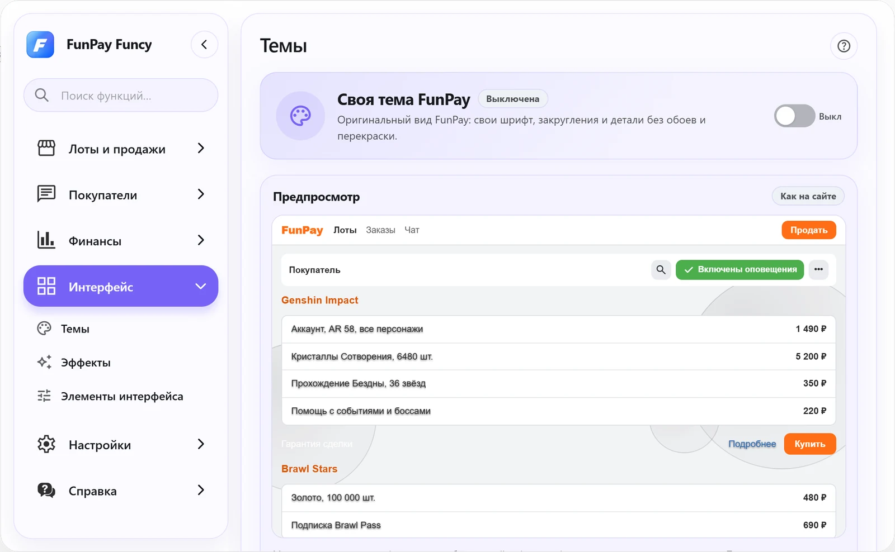
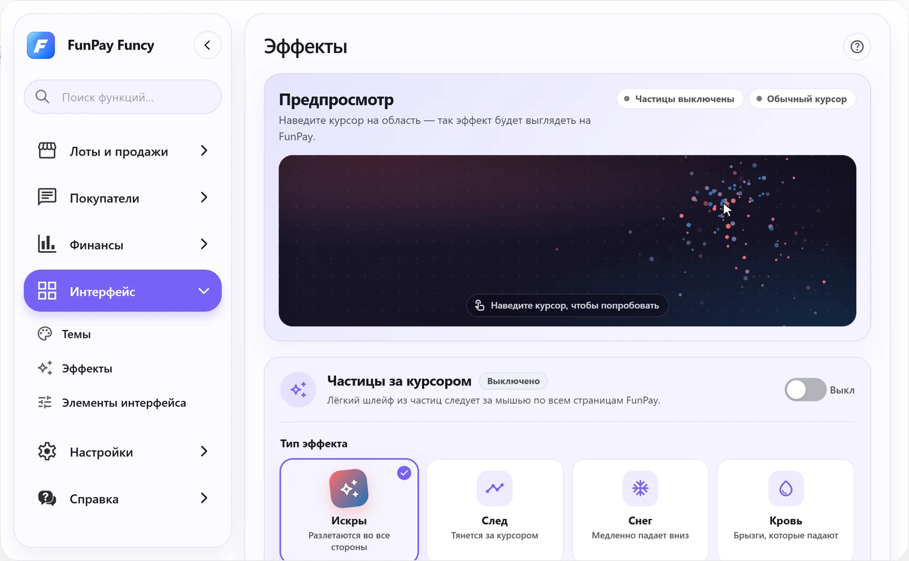

<div align="center">


<br/>


<a href="LICENSE"></a>

**[Лоты и продажи](#-лоты-и-продажи)** · **[Покупатели](#-покупатели)** · **[Финансы](#-финансы)** · **[Интерфейс](#-интерфейс)** · **[На страницах FunPay](#-прямо-на-страницах-funpay)** · **[Установка](#-установка)**

</div>

<br/>

FunPay Funcy встраивается в FunPay: в шапке сайта появляется кнопка, которая открывает окно со всеми инструментами. Автовыдача, автоответчик и автоподнятие работают в фоне, пока открыт браузер.

<br/>

<picture>
  <source media="(prefers-color-scheme: dark)" srcset=".github/assets/screens/finance-dark.webp"/>
  
</picture>


## 🛒 Лоты и продажи

**Управление лотами.** Резервная копия лотов выбранных категорий в JSON и перенос из файла. Если импорт прервался, его можно продолжить, отложить или пропустить отдельный лот. Массовое редактирование названий, описаний, цен и активности сразу у многих лотов.

**Автовыдача.** Сразу после оплаты покупатель получает товар со склада FunPay или ваш шаблон в чате. Настройки по каждому лоту, проверка остатков, автовосстановление лота, когда товар снова появился, и деактивация при пустом складе. Каждая выдача записывается в журнал, поэтому один заказ не обслуживается дважды, а пропущенные оплаты догоняются при сверке.

**Автоподнятие.** Поднимает лоты по категориям и сам ставит следующую попытку на то время, которое назвал FunPay. Можно поднимать только выбранные категории или только те, где есть автовыдача. Журнал событий и кнопка «Поднять сейчас».

<table>
  <tr>
    <td width="50%"><picture><source media="(prefers-color-scheme: dark)" srcset=".github/assets/screens/lots-dark.webp"/></picture></td>
    <td width="50%"><picture><source media="(prefers-color-scheme: dark)" srcset=".github/assets/screens/autobump-dark.webp"/></picture></td>
  </tr>
  <tr>
    <td align="center"><sub>Управление лотами</sub></td>
    <td align="center"><sub>Автоподнятие</sub></td>
  </tr>
</table>


## 💬 Покупатели

**Автоответчик.** Приветствие новых покупателей (с повтором раз в N дней или только в новых чатах), сообщение после оплаты заказа и после его подтверждения, ответы по ключевым словам с точным совпадением или вхождением. К ответу можно приложить картинки и выбрать, что уйдёт первым.

**Отзывы и бонусы.** Свой ответ на каждую оценку от 1 до 5★ с подстановкой имени покупателя, названия лота, номера и ссылки на заказ. Если вы уже ответили вручную, автоответ не отправляется. За отзыв 5★ покупатель получает бонус: один или случайный из списка, с паузой после ответа.

**Быстрые ответы.** Кнопка с шаблонами рядом со скрепкой в каждом диалоге и слэш-команды: набираете `/команду`, и текст разворачивается прямо в поле ввода.

**Чёрный список.** Для каждого покупателя отдельно отключаются автовыдача и автоответы, с заметкой о причине.

**Звук уведомлений.** Готовые мелодии (FunPay, ВКонтакте, Telegram, iPhone, Discord, WhatsApp), громкость и свой трек, из которого вырезается отрывок до 5 секунд.

<table>
  <tr>
    <td width="50%"><picture><source media="(prefers-color-scheme: dark)" srcset=".github/assets/screens/templates-dark.webp"/></picture></td>
    <td width="50%"></td>
  </tr>
  <tr>
    <td align="center"><sub>Быстрые ответы</sub></td>
    <td align="center"><sub>Отзывы и бонусы</sub></td>
  </tr>
  <tr>
    <td width="50%"><picture><source media="(prefers-color-scheme: dark)" srcset=".github/assets/screens/blacklist-dark.webp"/></picture></td>
    <td width="50%"><picture><source media="(prefers-color-scheme: dark)" srcset=".github/assets/screens/sounds-dark.webp"/></picture></td>
  </tr>
  <tr>
    <td align="center"><sub>Чёрный список</sub></td>
    <td align="center"><sub>Звук уведомлений</sub></td>
  </tr>
</table>


## 📊 Финансы

**Обзор и аналитика** собирает продажи, покупки и операции по балансу в одном месте. Шесть вкладок:

| Вкладка | Что показывает |
| :--- | :--- |
| **Обзор** | Выручка, чистая прибыль, заказы, средний чек, склад и потенциал, динамика, структура по категориям, топ товаров |
| **Продажи** | Выручка, оплаченные заказы, возвраты и споры, продажи по категориям, детализация |
| **Покупки** | Расходы, топ продавцов, история покупок |
| **Прибыль** | Реализованная прибыль, себестоимость, маржинальность, ROI, покрытие себестоимости |
| **Потенциал** | Потенциальная выручка и прибыль, стоимость склада, активные предложения |
| **Операции** | Пополнения, выводы, чистый поток и история операций баланса |

Фильтры по периоду, валюте, категории и статусу заказа, экспорт данных. Себестоимость лота указывается прямо в редакторе лота и хранится только у вас в браузере.

<table>
  <tr>
    <td width="50%"><picture><source media="(prefers-color-scheme: dark)" srcset=".github/assets/screens/finance-sales-dark.webp"/></picture></td>
    <td width="50%"><picture><source media="(prefers-color-scheme: dark)" srcset=".github/assets/screens/finance-profit-dark.webp"/></picture></td>
  </tr>
  <tr>
    <td align="center"><sub>Продажи</sub></td>
    <td align="center"><sub>Прибыль</sub></td>
  </tr>
</table>


## 🎨 Интерфейс

**Темы.** Своя тема FunPay: фоновое изображение с размытием и яркостью, подбор цветов по картинке, свои цвета, шрифт и закругления, прозрачность блоков, матовое стекло, свой скроллбар, верхняя панель сверху или снизу. Готовые темы из каталога, чёрная и случайная тема, редактор отдельных элементов сайта, экспорт, импорт и обмен темами. Тема применяется и на support.funpay.com.

**Эффекты.** Частицы за курсором (искры, след, снег, кровь) со своими цветами или радугой и свой курсор с размером и прозрачностью.

**Элементы интерфейса.** Всё, что Funcy добавляет на страницы FunPay, можно скрыть по одному с предпросмотром или описать словами, а ИИ подберёт подходящие элементы.

<table>
  <tr>
    <td width="50%"><picture><source media="(prefers-color-scheme: dark)" srcset=".github/assets/screens/theme-dark.webp"/></picture></td>
    <td width="50%"><picture><source media="(prefers-color-scheme: dark)" srcset=".github/assets/screens/effects-dark.webp"/></picture></td>
  </tr>
  <tr>
    <td align="center"><sub>Темы</sub></td>
    <td align="center"><sub>Эффекты</sub></td>
  </tr>
</table>

<picture>
  <source media="(prefers-color-scheme: dark)" srcset=".github/assets/screens/interface-dark.webp"/>
  
</picture>


## ⚙️ Настройки и поддержка

**Аккаунты.** Сохраняйте несколько аккаунтов FunPay и переключайтесь между ними.

**Отображение FunPay.** Скрыть баланс, показать комиссию раздела и реальные цены лотов, историю покупок собеседника в чате, сумму неподтверждённых заказов и метку «FunPay Funcy» рядом с ником собеседника.

**Перенос настроек.** Все настройки выгружаются в файл `.fpconfig` и загружаются на другом компьютере. Там же — сброс данных.

**Поддержка FunPay.** Заявки в техподдержку прямо в окне расширения: создание, переписка, поиск, сортировка и закрытие. Расширение может само собрать оплаченные, но не подтверждённые заказы и подготовить заявку с просьбой их закрыть.

<picture>
  <source media="(prefers-color-scheme: dark)" srcset=".github/assets/screens/support-dark.webp"/>
  
</picture>


## 🧩 Прямо на страницах FunPay

Кроме окна, Funcy добавляет кнопки и поля на сами страницы сайта. Любой из этих элементов можно скрыть в разделе «Элементы интерфейса».

<details open>
<summary><b>Чат</b></summary>
<br/>

- Кнопка ИИ-режима рядом с отправкой: переписывает черновик в вежливое сообщение
- Несколько фото в одном сообщении с подписью и редактор перед отправкой: обрезка, кисть, ластик
- Фото складываются в альбомы и открываются в полноэкранном просмотре
- Ответ на конкретное сообщение и перевод сообщения при наведении
- Поиск по сообщениям в открытом диалоге
- Счётчик символов и предупреждение о грубости с предложением исправить текст через ИИ
- Кнопка «Прочитать все» и фильтр «Только помеченные»
- Цветные метки собеседников и закрепление чатов
- В меню диалога: история покупок собеседника, перевод переписки, экспорт в `.txt`, добавление в чёрный список

</details>

<details>
<summary><b>Создание и редактирование лота</b></summary>
<br/>

- ИИ-генерация названия и описания
- Генератор картинки-превью для лота
- Клавиатура спецсимволов и шрифты для оформления
- Перевод лота на английский через ИИ
- Расчёт цены, чтобы получить нужную сумму на руки, и живое поле «Цена покупателю»
- Поле «Себестоимость» с предпросмотром чистой прибыли
- «Копировать» и «Импорт» своего лота, панель вставки скопированных данных
- «Свежее в категории»: 10 новых лотов из той же категории и чат категории

</details>

<details>
<summary><b>Список лотов, профиль и категории</b></summary>
<br/>

- Поиск по своим лотам без перезагрузки
- «Выбрать» и «Включить лоты» для массовых действий
- «Поднять все лоты» на профиле
- Блок закреплённых лотов
- Кнопка перехода на сам лот и быстрая кнопка удаления
- Копирование чужого лота и нескольких лотов с чужого профиля к себе
- «Аналитика рынка» на странице категории
- Поиск продавца по нику на RMTHub в верхней панели

</details>

<details>
<summary><b>Заказы</b></summary>
<br/>

- Номер заказа копируется одним кликом
- Таймер до автоматического подтверждения заказа
- Метки типа заказа
- Кнопка «Попросить отзыв» у закрытых заказов
- «Копировать лот» со страницы купленного заказа

</details>


## 📥 Установка

1. Скачайте репозиторий: **Code → Download ZIP** и распакуйте, или
   ```bash
   git clone https://github.com/jgchkcu-maker/funpay-funcy.git
   ```
2. Откройте `chrome://extensions` и включите **режим разработчика**.
3. Нажмите **«Загрузить распакованное»** и выберите папку проекта.
4. Зайдите на [funpay.com](https://funpay.com/): в шапке появится кнопка **FunPay Funcy**.

Работает в Chrome и других браузерах на Chromium.

## 🧑‍💻 Для разработчиков

Чистый JavaScript без сборки: правите файл и перезагружаете расширение на `chrome://extensions`.

```text
background/   service worker: автоответчик, автовыдача, автоподнятие, журнал операций
content/      всё, что работает на страницах FunPay
  features/   отдельные функции сайта
  ui/         разделы окна расширения
css/          стили окна и тем
popup/        окно по клику на иконку расширения
offscreen/    разбор HTML-страниц FunPay в фоне
tests/        тесты на node:test
```

```bash
node --test tests/*.test.js
```

Браузерные тесты используют Playwright и установленный Chrome.

Нашли ошибку или есть идея — [откройте issue](https://github.com/jgchkcu-maker/funpay-funcy/issues/new/choose).


<div align="center">
<sub>Распространяется под лицензией <a href="LICENSE">MIT</a></sub>
</div>
