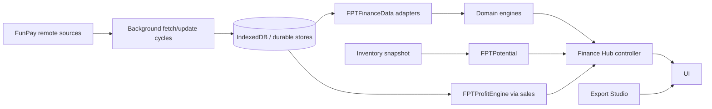

# Finance Hub Hardening — Architecture Delivery Pack

**Repository:** `jgchkcu-maker/funpay-funcy`  
**Target agent:** Gemini 3.8 Flash / other fast code agents  
**Primary goal:** make Finance Hub trustworthy before adding more features.

This package is intentionally split into small, bounded tasks. The previous implementation accumulated multiple semantic domains in the same controller: refresh orchestration, filtering, data freshness, currency normalization, lifecycle, export, and UI state. Fast agents are much more reliable when each of those concerns is handled independently with explicit acceptance tests.

## Critical findings already identified

1. Finance operations refresh clears the existing IndexedDB before the full replacement dataset is safely fetched.
2. Update cycles can log failures yet still allow the caller/UI to behave as if the operation succeeded.
3. `lastUpdate` can be advanced even when refresh fails.
4. Overview refresh does not refresh every source used by Overview.
5. Profit refresh can recalculate from stale sales data instead of refreshing sales first.
6. Order statuses and finance-operation statuses are different domains but share UI state.
7. Potential is a current inventory snapshot, yet the UI exposes historical period controls.
8. Filtering uses MSK in places while chart grouping can use the machine timezone.
9. Multiple hard-coded FX approximations exist and can lead to inconsistent charts.
10. Render-time freshness can be confused with source-data freshness.
11. Finance Hub lifecycle/event ownership is split between `finance_hub.js` and `main_popup.js`.
12. Finance Hub has its own export flow while the repository already contains a richer Export Studio.
13. Custom ranges are already partially supported at the data layer but are absent from the UI.
14. Regression coverage exists but does not protect most orchestration/failure scenarios.

## Execution order

`T00 → T01 → T02 → T03 → T04 → T05 → T06 → T07 → T08 → T09 → T10 → T11 → T12 → T13 → T14`

### Milestones

- **Safety milestone:** T01–T03
- **Semantic correctness milestone:** T04–T08
- **Architecture cleanup milestone:** T09–T10
- **Product enhancements:** T11–T12
- **Regression lock + audit:** T13–T14

## How to use this pack

1. Open `AGENT_CONTRACT.md`.
2. Give it to the agent together with exactly one task file.
3. After completion, inspect the diff.
4. Run the task's tests and `node tests/t11_hardening.test.js`.
5. Only then advance to the next task.
6. Record exceptions in `docs/RISK_REGISTER.md`.

Do **not** give the agent the instruction “fix the whole Finance Hub”. That defeats the package design.

## Core architecture target

The controller should orchestrate and render; it should not become the second persistence layer, exchange-rate engine, or hidden state machine.
